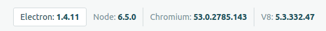

# Cevirgec

Personal Vocabulary Trainer

# Run the App on Development

First *make sure that you are using the right `node` version*. It is strongly advised to use NVM.

If you're using `nvm` then execute `nvm use` to switch to right version. It uses `.nvmrc`.

Enable debug output:

	export DEBUG=*,-babel

	// enable all debug logs https://github.com/visionmedia/debug#browser-support
	localStorage.debug = '*';


Run these two commands simultaneously in different console tabs.

	$ npm run hot-server
	$ npm run start-hot

or run two servers with one command

	$ npm run dev

you can also use `tmux`

		./init-tmux.sh
		tmux attach

# Development Installation


## sqlite3 problem

```
	Error: Please install sqlite3 package manually
			at new ConnectionManager (/home/sedat/Desktop/projects/cevirgec-rewrite/node_modules/sequelize/lib/dialects/sqlite/connection-manager.js:25:13)
			at new SqliteDialect (/home/sedat/Desktop/projects/cevirgec-rewrite/node_modules/sequelize/lib/dialects/sqlite/index.js:12:28)
			at new Sequelize (/home/sedat/Desktop/projects/cevirgec-rewrite/node_modules/sequelize/lib/sequelize.js:233:18)
			at Object.<anonymous> (/home/sedat/Desktop/projects/cevirgec-rewrite/backend/Sequelize.js:12:19)
			at Module._compile (module.js:556:32)
			at loader (/home/sedat/Desktop/projects/cevirgec-rewrite/node_modules/babel-register/lib/node.js:144:5)
			at Object.require.extensions.(anonymous function) [as .js] (/home/sedat/Desktop/projects/cevirgec-rewrite/node_modules/babel-register/lib/node.js:154:7)
			at Module.load (module.js:473:32)
			at tryModuleLoad (module.js:432:12)
			at Function.Module._load (module.js:424:3)
			at Module.require (module.js:483:17)
			at require (internal/module.js:20:19)
			at Object.<anonymous> (/home/sedat/Desktop/projects/cevirgec-rewrite/backend/model/User.js:9:17)
			at Module._compile (module.js:556:32)
			at loader (/home/sedat/Desktop/projects/cevirgec-rewrite/node_modules/babel-register/lib/node.js:144:5)
			at Object.require.extensions.(anonymous function) [as .js] (/home/sedat/Desktop/projects/cevirgec-rewrite/node_modules/babel-register/lib/node.js:154:7)
			at Module.load (module.js:473:32)
			at tryModuleLoad (module.js:432:12)
			at Function.Module._load (module.js:424:3)
			at Module.require (module.js:483:17)
			at require (internal/module.js:20:19)
			at Object.<anonymous> (/home/sedat/Desktop/projects/cevirgec-rewrite/backend/dao/UserDao.js:9:14)
```

Solution:

	npm install -g node-gyp
	./node_modules/.bin/electron-rebuild

http://electron.atom.io/docs/tutorial/using-native-node-modules/ -- 15.10.2016

## "Cannot call a class as a function"

possible causes:

* you have multiple `export default`
* your react class don't have `extends Component`

# Development Notes

## Versions



We use the same `node` version as our `electron` dependency's to prevent native module problems. See https://github.com/electron-userland/electron-builder/issues/39#issuecomment-145970010

1. Use storybook to design UI:
`$ npm run storybook`

2. Following this advice: https://twitter.com/dan_abramov/status/790581793397305345
3. This can be used for sqlite3 viewing [SQLite Browser](http://sqlitestudio.pl/?act=download)

4. Create mock data with id:

```
Array(10).fill().map(() => ({id: Math.ceil(Math.random()*1000)}))
```

## Error: Module did not self-register

```
		Uncaught Exception:
		Error: Module did not self-register.
		    at Error (native)
		    at process.module.(anonymous function) [as dlopen] (ELECTRON_ASAR.js:178:20)
		    at Object.Module._extensions..node (module.js:583:18)
		    at Object.module.(anonymous function) [as .node] (ELECTRON_ASAR.js:178:20)
		    at Module.load (module.js:473:32)
		    at tryModuleLoad (module.js:432:12)
		    at Function.Module._load (module.js:424:3)
		    at Module.require (module.js:483:17)
		    at require (internal/module.js:20:19)
		    at Object.<anonymous> (/home/destanpse/development/workspaces/cevirgec/node_modules/sqlite3/lib/sqlite3.js:4:15)
		    at Module._compile (module.js:556:32)
		    at Module._extensions..js (module.js:565:10)
		    at Object.require.extensions.(anonymous function) [as .js] (/home/destan/development/workspaces/cevirgec/node_modules/babel-register/lib/node.js:152:7)
		    at Module.load (module.js:473:32)
		    at tryModuleLoad (module.js:432:12)
		    at Function.Module._load (module.js:424:3)
		    at Module.require (module.js:483:17)
		    at require (internal/module.js:20:19)
		    at new ConnectionManager (/home/destan/development/workspaces/cevirgec/node_modules/sequelize/lib/dialects/sqlite/connection-manager.js:22:16)
		    at new SqliteDialect (/home/destan/development/workspaces/cevirgec/node_modules/sequelize/lib/dialects/sqlite/index.js:12:28)
		    at new Sequelize (/home/destan/development/workspaces/cevirgec/node_modules/sequelize/lib/sequelize.js:233:18)
		    at Object.<anonymous> (/home/destan/development/workspaces/cevirgec/backend/Sequelize.js:12:19)
		    at Module._compile (module.js:556:32)
		    at loader (/home/destan/development/workspaces/cevirgec/node_modules/babel-register/lib/node.js:144:5)
		    at Object.require.extensions.(anonymous function) [as .js] (/home/destan/development/workspaces/cevirgec/node_modules/babel-register/lib/node.js:154:7)
		    at Module.load (module.js:473:32)
		    at tryModuleLoad (module.js:432:12)
		    at Function.Module._load (module.js:424:3)
		    at Module.require (module.js:483:17)
		    at require (internal/module.js:20:19)
		    at Object.<anonymous> (/home/destan/development/workspaces/cevirgec/backend/model/User.js:9:17)
		    at Module._compile (module.js:556:32)
		    at loader (/home/destan/development/workspaces/cevirgec/node_modules/babel-register/lib/node.js:144:5)
		    at Object.require.extensions.(anonymous function) [as .js] (/home/destan/development/workspaces/cevirgec/node_modules/babel-register/lib/node.js:154:7)
```

Solution:

    # npm rebuild won't work
		rm -rf node_modules
		npm i
		./node_modules/.bin/electron-rebuild

# Releasing

When released `Cevirgec` binary requires `resources/images` folder to be same level with itself because of this line: `trayIcon = new Tray('resources/images/trayIcon.png');`

# Boilerplate Repo

https://github.com/chentsulin/electron-react-boilerplate

We forked at https://github.com/chentsulin/electron-react-boilerplate/tree/84e04776701c5fd71b8bac876899d1c9cfdb5b20.

# License

You can use this program free of charge.

Cevirgec  Copyright (C) 2015  Kod Gemisi Ltd. <foss@kodgemisi.com>
This program comes with ABSOLUTELY NO WARRANTY; for details type see LICENSE file.
This is free software, and you are welcome to redistribute it
under certain conditions; see LICENSE file for details.

GNU GPL v3 https://www.gnu.org/licenses/gpl-3.0.en.html
